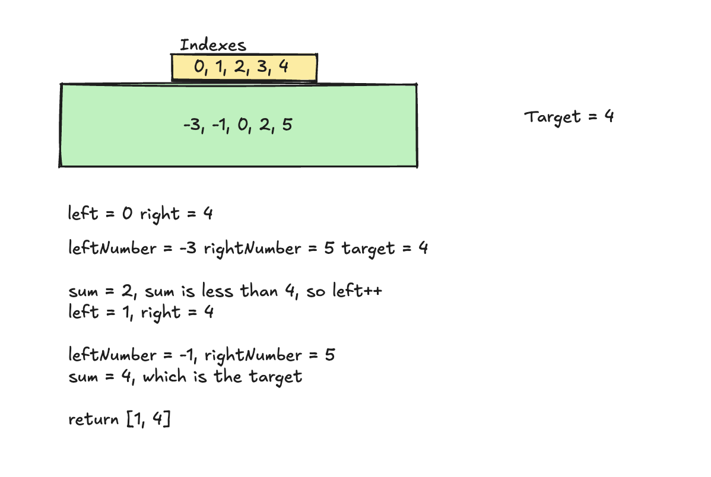

## Problem solving techniques: Two pointers

### The two pointer pattern is used to solve an algorithm. It consists of two variables that represent an index or a position (hence a pointer).

```
    compare(nums[left], nums[right]){
        // Do something
    }
```

### But what about a nested for loop? It has two pointers, what is the difference?


#### In the below code snippet, we are comparing every two elements in an array.
```java
// Time complexity - O(nˆ2)
for(int i = 0; i < n; i++){
    for(int j = i + 1; j < n; j++){
        compare(nums[i], nums[j])
    }
}
```

### But often, there is predictable behavior in our algorithms that can be used to solve them more optimally.

## Example - Pair Sum - Sorted array

> Given an array of integers sorted in ascending order and a targe value, return the indexes of any pair of numbers in the array that sum to the target. If no pair is found, return an empty array.

### Brute force approach - check e very pair

```go

package main

func twoPairSum(numbers []int, target int) []int {
	for i := 0; i < len(numbers); i++ {
		for j := i + 1; j < len(numbers); j++{
			if numbers[j] + numbers[i] == target{
				return []int{i, j}
			}
		}
	}
	return []int{};
}
```

### Optimized approach

> Since the array is sorted, we know that left values will always be smaller than the right values. So, assuming we have two pointers, one left and one right. If the sum of both values associated to those pointers is bigger than the target, we can move the right pointer to the left, which will result in a smaller sum. Now if the sum of both values is smaller than the target, we can move the left pointer to the right, which will result in a bigger sum.


```go
func twoPairSumTwoPointers(numbers []int, target int) [] int {
	left := 0;
	right := len(numbers) - 1

	for left < right{
		sum := numbers[left] + numbers[right]

		if sum < target {
			left++
		} else if sum > target {
			right--
		} else {
			return []int{left, right}
		}
	}

	return []int{};
}
```

### Let's do a quick table test, assuming our array is [-3, -1, 0, 2, 5]



### So this is how you solve Pair Sum - Sorted Array using the two pointers technique!